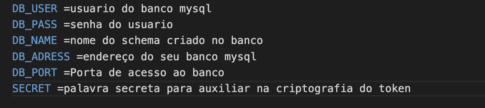
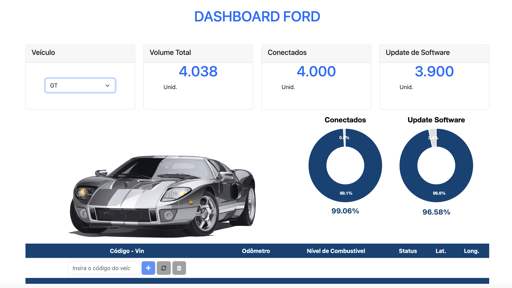
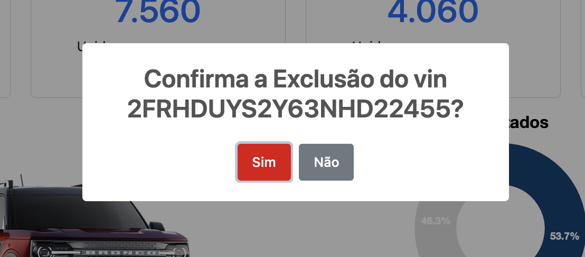

<h1 align='center' >Desafio Full Stack Rodrigo Paixão de Souza</h1>

# ForDashboard

Este é um projeto gerado com [Angular CLI](https://github.com/angular/angular-cli) version 14.0.4. para o CURSO DE FORMACÃO TI do SENAI CIMATEC e FORD

## Requisitos
As seguintes ferramentas foram usadas na construção do projeto:

- [Node.js](https://nodejs.org/en/)
- [React](https://pt-br.reactjs.org/)
- [React Native](https://reactnative.dev/)
- [TypeScript](https://www.typescriptlang.org/)
- [Mysql](https://www.mysql.com/)
- [Angular](https://angular.io/)

## Antes de Rodar a aplicação

### API

- Crie um Schema no seu banco de dado Mysql
- Crie um arquivo .env e insira as informações abaixo:

<h1 align="right">
  
</h1>

- Execute dentro da pasta da aplicação o comando npm i

### Dashboard

- Execute dentro da pasta da aplicação o comando npm i

## Utilizando a aplicação!

Para rodar o seriço, execute `ng serve`. Navegue pelo link `http://localhost:4200/`. A aplicação irá automaticamente carregar os dados padrões assim como seu banco de dados.

## Sobre mim

Me chamo Rodrigo Paixão de Souza, esse é meu projeto final do curso de formação em TI, Esse foi um grande desafio e também um momento de muita satisfação. 

Onde pude me desafiar profissionalmente e agregar muito conhecimento. Foi algo totalmente novo, já que não tinha nenhum conhecimento em HTML, CSS, Javascript, Typescript e Angular. Por isso poder analisar de onde comecei até aqui foi muito bom.

## Status do Projeto

Consegui finalizar 100% das etapas solicitadas no documento do desafio, mas ainda gostaria de implementar algumas funcionalidades.

- [X] Schema do Banco de Dados com as Tabelas Veiculos, Dados dos Veiculos e Usuário
- [X] Operacões Listar Todos, Incluir Registro, Listar um registro, Alterar dado e Excluir dado
- [X] Frontend enviando e recebendo dados para o banco Mysql

<h1 align="center">
  
</h1>

## Acesso ao Projeto

Para acessar automatizei o login para teste da aplicação, mas foram criados os seguintes usuários admin, marcos, patricia e rodrigo todos possuem senha padrão "123456" para teste da API

## Alterações

Foram incluidos alguns modelos de carros a mais para teste da aplicaçao.

## Comandos para consulta na API

Endereços:
- http://localhost:3000/user
- http://localhost:3000/vehicle
- http://localhost:3000/vehicledata

Get all:

- get http://localhost:3000/user
- get http://localhost:3000/vehicle
- get http://localhost:3000/vehicledata

Get por ID

- get http://localhost:3000/user/1
- get http://localhost:3000/vehicle/1
- get http://localhost:3000/vehicledata/1

Post

- post http://localhost:3000/user
- post http://localhost:3000/vehicle
- post http://localhost:3000/vehicledata

Put

- put http://localhost:3000/user/1 (com dados a serem alterados)
- put http://localhost:3000/vehicle/1 (com dados a serem alterados)
- put http://localhost:3000/vehicledata/1 (com dados a serem alterados)

Delete

- delete http://localhost:3000/user/1 (ou id de qualquer item que queira excluir)
- delete http://localhost:3000/vehicle/1 (ou id de qualquer item que queira excluir)
- delete http://localhost:3000/vehicledata/1 (ou id de qualquer item que queira excluir)

## Exemplos

<h1 align="left">
  
</h1>

<h1 align="right">
  
</h1>

